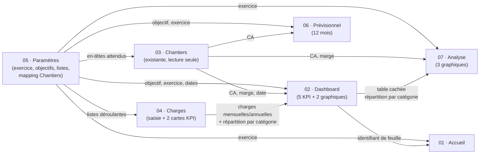

# Architecture technique — ERP Matière & Nuance

Document de référence pour quiconque modifie ce projet : plages nommées,
dépendances entre feuilles, flux de données, ordre d'installation.
Le README.md reste le point d'entrée (déploiement, choix produit) ; ce
document est la carte interne du moteur.

## 1. Principe général

Le classeur ne contient aucune base de données externe : les cellules
*sont* la base de données. Le script Apps Script ne fait que (re)poser
la structure — en-têtes, formules, validations, protections, graphiques
— autour de deux catégories de données qui, elles, ne sont jamais
générées par le script et doivent survivre à toute réinstallation :

- les **cellules de saisie** (Paramètres!B4:B9, Paramètres!B12:B15,
  Charges!A8:H1000) ;
- la feuille **Chantiers**, entièrement possédée par le client.

Toute formule du classeur qui a besoin d'une donnée passe par une
**plage nommée**, jamais par une référence de cellule brute (`Feuille!A1`)
ni par une valeur écrite en dur. C'est le seul mécanisme de couplage
entre feuilles — voir §3.

## 2. Table complète des plages nommées

| Plage nommée | Feuille physique | Cellule / plage | Créée par | Nature |
|---|---|---|---|---|
| `PARAM_EXERCICE` | Paramètres | B4 | `buildParametres_()` | Saisie |
| `PARAM_DATE_DEBUT` | Paramètres | B5 | `buildParametres_()` | Saisie |
| `PARAM_DATE_FIN` | Paramètres | B6 | `buildParametres_()` | Saisie |
| `PARAM_OBJECTIF_CA` | Paramètres | B7 | `buildParametres_()` | Saisie |
| `PARAM_OBJECTIF_MARGE` | Paramètres | B8 | `buildParametres_()` | Saisie |
| `PARAM_SALAIRE_MENSUEL` | Paramètres | B9 | `buildParametres_()` | Saisie |
| `PARAM_CHANTIERS_HEADER_CA_HT` | Paramètres | B12 | `buildParametres_()` | Saisie (mapping) |
| `PARAM_CHANTIERS_HEADER_MARGE_HT` | Paramètres | B13 | `buildParametres_()` | Saisie (mapping) |
| `PARAM_CHANTIERS_HEADER_DATE` | Paramètres | B14 | `buildParametres_()` | Saisie (mapping) |
| `PARAM_CHANTIERS_HEADER_STATUT` | Paramètres | B15 | `buildParametres_()` | Saisie (mapping) |
| `LISTE_CATEGORIES` | Paramètres | H3:H12 (masquée) | `buildParametres_()` | Liste technique |
| `LISTE_TVA` | Paramètres | I3:I6 (masquée) | `buildParametres_()` | Liste technique |
| `LISTE_PERIODICITE` | Paramètres | J3:J6 (masquée) | `buildParametres_()` | Liste technique |
| `LISTE_OUI_NON` | Paramètres | K3:K4 (masquée) | `buildParametres_()` | Liste technique |
| `CHARGES_CATEGORIE` | Charges | A8:A1000 | `buildCharges_()` | Saisie (colonne) |
| `CHARGES_MONTANT_HT` | Charges | E8:E1000 | `buildCharges_()` | Saisie (colonne) |
| `CHARGES_PERIODICITE` | Charges | D8:D1000 | `buildCharges_()` | Saisie (colonne) |
| `CHARGES_ACTIF` | Charges | H8:H1000 | `buildCharges_()` | Saisie (colonne) |
| `CHARGES_MENSUELLES` | Charges | B4 (carte KPI) | `buildCharges_()` | Calculée |
| `CHARGES_ANNUELLES` | Charges | E4 (carte KPI) | `buildCharges_()` | Calculée |
| `CHANTIERS_CA_HT` | Chantiers (existante) | colonne trouvée par en-tête, 5000 lignes | `ensureChantiersLinks_()` | Lecture seule |
| `CHANTIERS_MARGE_HT` | Chantiers (existante) | colonne trouvée par en-tête, 5000 lignes | `ensureChantiersLinks_()` | Lecture seule |
| `CHANTIERS_DATE` | Chantiers (existante) | colonne trouvée par en-tête, 5000 lignes | `ensureChantiersLinks_()` | Lecture seule |
| `CHANTIERS_STATUT` | Chantiers (existante) | colonne trouvée par en-tête, 5000 lignes | `ensureChantiersLinks_()` | Lecture seule (reliée, non filtrée — voir README) |
| `PARAM_CHANTIERS_FALLBACK_VIDE` | Paramètres | M1 (masquée, toujours vide) | `buildParametres_()` | Technique (V3, repli d'erreur) |
| `DASHBOARD_CA_REALISE` | Dashboard | B4 (carte KPI) | `buildDashboard_()` | Calculée |

Toutes les créations/mises à jour de plages nommées passent par
`setNamedRange_()` (`01_Utils.gs`), qui supprime l'ancienne définition
avant d'en recréer une — une réinstallation ne laisse donc jamais de
plage obsolète pointant vers du vide.

## 3. Graphe de dépendances entre feuilles



Point notable, volontaire : **Analyse dépend de Dashboard**, pas
seulement de Chantiers/Charges. Le graphique « Charges par catégorie »
d'Analyse réutilise directement la table cachée calculée par
`buildDashboardDonneesCategories_()` plutôt que de refaire le même
calcul une deuxième fois. Conséquence directe : **Dashboard doit
toujours être (re)construit avant Analyse** — c'est pour cette raison,
et pas seulement pour suivre l'ordre du cahier des charges, que
`installerERP()` respecte l'ordre ci-dessous.

## 4. Ordre d'installation (`99_Installation.gs`)

```
1. buildParametres_()        → doit être en premier : tout le reste lit ses plages nommées
2. buildCharges_()           → a besoin des listes de Paramètres (dropdowns)
3. ensureChantiersLinks_()   → a besoin du mapping saisi dans Paramètres (§2)
4. buildDashboard_()         → a besoin de Paramètres + Charges + Chantiers
5. buildPrevisionnel_()      → a besoin de Paramètres + Chantiers
6. buildAnalyse_()           → a besoin de Chantiers + PARAMÈTRES + DASHBOARD (table cachée réutilisée)
7. buildAccueil_()           → a besoin de Dashboard (identifiant de feuille pour le bouton)
```

Inverser 4 et 6, ou construire Analyse seule sans passer par
`installerERP()`, casse le 3ᵉ graphique d'Analyse (plage `Dashboard!T:U`
introuvable ou périmée). `buildAnalyse_()` appelle `getRequiredSheet_()`
sur Dashboard précisément pour échouer bruyamment dans ce cas plutôt que
produire un graphique vide silencieusement.

## 5. Modèle de protection

Deux régimes coexistent, jamais mélangés sur une même cellule :

- **Cellule de saisie** (`styleInputCell_()`) : fond légèrement teinté,
  bordure couleur accent, jamais protégée, jamais écrasée par une
  réinstallation si elle contient déjà une valeur. La liste exhaustive
  de ces plages est centralisée dans `EDITABLE_RANGES`
  (`00_Constantes.gs`) — c'est la source unique de vérité que
  `reappliquerProtectionsFormules_()` consulte pour savoir ce qu'il ne
  doit jamais protéger.
- **Cellule calculée** (`protectAsCalculated_()`) : protection
  « avertissement » (`setWarningOnly(true)`) — l'édition reste possible
  mais un message prévient qu'il s'agit d'une formule. Choisi plutôt
  qu'un verrouillage dur pour éviter d'avoir à gérer une liste
  d'éditeurs autorisés, pour un classeur à utilisateur unique.

Chaque `build*_()` de feuille 100 % calculée (Dashboard, Prévisionnel,
Analyse, Accueil) commence par `resetSheet_()`, qui supprime d'abord
toutes les anciennes protections (`removeAllProtections_()`) avant
d'en reposer de nouvelles — une réinstallation ne accumule donc jamais
de protections fantômes.

**V3 — filet de sécurité générique** (`04_Protections.gs`) :
`reappliquerProtectionsFormules_()` s'exécute en toute fin
d'`installerERP()` et balaie l'ensemble du classeur (hors Chantiers)
pour protéger toute cellule à formule qui aurait échappé à la
protection explicite d'un module. Elle **n'efface jamais** les
protections existantes avant de balayer : une cellule déjà protégée
(y compris une carte KPI fusionnée sur plusieurs colonnes, où
`getFormulas()` ne voit la formule que dans la cellule en haut à
gauche) est simplement ignorée. C'est ce qui la rend sûre à appeler
un nombre quelconque de fois, y compris manuellement depuis le menu
(Pilotage ▸ Réappliquer les protections), sans jamais accumuler de
protections redondantes ni casser une protection posée autrement.

## 6. Colonnes/lignes cachées, par feuille

| Feuille | Zone cachée | Contenu |
|---|---|---|
| Paramètres | Colonnes H:M | Listes techniques (H:K), espaceur (L), cellule de repli Chantiers (M — V3) |
| Dashboard | Colonnes Q:V | Table mensuelle CA (Q:R) + répartition par catégorie (T:U) — sources des 2 graphiques |
| Analyse | Colonnes J:L | Table mensuelle CA (K) / Marge (L) — sources des 2 premiers graphiques |

Rien n'est jamais masqué dans Charges ou Chantiers : ce sont des
tableaux de saisie/lecture, aucune donnée technique n'y est ajoutée.

## 7. Nouvel exercice (85_NouvelExercice.gs)

Seul module qui n'opère pas sur le classeur actif : `Spreadsheet.copy()`
retourne directement l'objet `Spreadsheet` de la copie, sur lequel
`prepareParametresNouvelExercice_()` et `viderChantiersDonnees_()`
appellent `ss.getSheetByName(...)` explicitement (jamais
`SpreadsheetApp.getActiveSpreadsheet()`, qui renverrait le fichier
d'origine, pas la copie). C'est la seule raison technique qui empêche
de réutiliser tel quel `buildParametres_()`/`ensureChantiersLinks_()`
ici — tout le reste du classeur copié (formules, plages nommées,
graphiques, protections) fonctionne sans reconstruction car il ne
dépend que de plages nommées internes au fichier, dupliquées avec lui.

## 9. Gestion des erreurs (V3, `03_Erreurs.gs`)

Deux mécanismes distincts, à ne pas confondre :

1. **Exceptions Apps Script** (une feuille ou une plage nommée
   supprimée provoquerait un plantage technique) : les fonctions
   `getSheetSafe_()`, `getNamedRangeSafe_()`, `getNamedValueSafe_()` ne
   lèvent jamais d'exception — elles renvoient `null`/une valeur par
   défaut. `afficherErreur_()` centralise l'affichage d'un message
   utilisateur compréhensible (`ui.alert` préfixé `⚠️`).
2. **Erreurs de formule** (`#REF!`, `#N/A!`, `#VALUE!`, `#NOM?`) :
   `avecIferror_(corps, repli)` enveloppe systématiquement les formules
   générées par le script. Appliqué au niveau des générateurs partagés
   (`monthlyAmountFormula_`, `annualAmountFormula_` dans `01_Utils.gs`,
   `chargesEquivalentMensuelFormula_` dans `20_Charges.gs`), ce qui
   protège aussi le Dashboard sans qu'aucune ligne de
   `40_Dashboard.gs` n'ait eu besoin d'être modifiée — ces deux
   générateurs sont exactement ce que le Dashboard appelle pour ses
   propres cartes et sa table cachée.

**Repli Chantiers** : si une colonne attendue est introuvable,
`ensureChantiersLinks_()` (`30_Chantiers.gs`) ne laisse jamais une
plage nommée `CHANTIERS_*` indéfinie — elle la fait pointer vers
`PARAM_CHANTIERS_FALLBACK_VIDE` (Paramètres!M1, toujours vide). Sans ce
filet, chaque formule référençant cette plage afficherait `#NOM?` dans
tout le classeur ; avec lui, l'indicateur concerné affiche simplement
0, et Pilotage ▸ Diagnostic (ou Vérifier la structure Chantiers)
signale clairement le problème réel.

## 10. Validation des données (V3)

Chaque cellule de saisie a un type explicite et une règle de
validation stricte (`setAllowInvalid(false)`) :

| Champ | Règle |
|---|---|
| Charges!Montant HT | Nombre ≥ 0 |
| Charges!Date de début | Date valide |
| Charges!Catégorie / Périodicité / TVA / Actif | Valeur de la liste correspondante uniquement |
| Paramètres!Exercice | Nombre ≥ 1900 |
| Paramètres!Date début / fin | Date valide |
| Paramètres!Objectif CA HT / Salaire mensuel | Nombre ≥ 0 |
| Paramètres!Objectif Marge | Nombre entre 0 et 1 (0 % à 100 %) |

## 11. Mise en forme conditionnelle (V3)

Toujours sobre — jamais de rouge ni de vert saturé (`COLORS.INACTIF_BG`,
`COLORS.OBJECTIF_ATTEINT_BG`, `COLORS.OBJECTIF_DEPASSE_BG`,
`COLORS.OBLIGATOIRE_VIDE_BG`, `00_Constantes.gs`) :

| Feuille | Règle | Effet |
|---|---|---|
| Charges | `Actif = "Non"` | Ligne entière en gris très clair |
| Prévisionnel | `Ecart > Objectif × 10 %` | Fond accent (dépassé) |
| Prévisionnel | `Ecart ≥ 0` | Fond accent très léger (atteint) |
| Paramètres | Exercice/dates/Objectif CA vides | Fond d'attention très léger |

## 12. Diagnostic (V3, `90_Diagnostic.gs`)

Menu **Pilotage ▸ Diagnostic** exécute 7 contrôles indépendants
(feuilles, plages nommées, protections, colonnes Chantiers, paramètres
obligatoires, graphiques, listes) via `creerRapportSection_()` (helper
partagé, évite de dupliquer la mise en forme du rapport) et affiche un
score global + le détail dans une boîte de dialogue. Purement en
lecture, à l'exception de la vérification Chantiers qui réutilise
`ensureChantiersLinks_()` (déjà non destructive, voir §8.1).

## 13. Performance (V3)

- `getSpreadsheet_()` (`01_Utils.gs`) met en cache le classeur actif
  pour la durée d'une exécution — évite des dizaines d'appels
  redondants à `SpreadsheetApp.getActiveSpreadsheet()` par
  installation. Jamais utilisé pour la copie créée par "Nouvel
  exercice", qui n'est pas le classeur actif (voir §7).
- `ensureChantiersLinks_()` lit la ligne d'en-tête de Chantiers **une
  seule fois** et réutilise ce tableau pour ses 4 recherches
  (`findColumnInHeaders_()`), au lieu de relire la feuille à chaque
  champ.
- Les tableaux mensuels (Dashboard, Prévisionnel, Analyse) calculent
  leurs 12 (ou 24/36) formules en JavaScript pur puis les écrivent en
  un seul appel `setFormulas()`/`setValues()` par colonne, au lieu d'un
  appel par cellule — de même pour les formats numériques, arrière-
  plans et protections, regroupés par plage plutôt que posés cellule
  par cellule.
- `protegerCellulesAFormule_()` (`04_Protections.gs`) lit les formules
  et les protections existantes en un seul appel chacune, puis protège
  par segments de colonnes contiguës plutôt qu'une Protection par
  cellule.
- Non optimisé, en connaissance de cause : les formules
  `SUMPRODUCT` sur Chantiers (jusqu'à 5000 lignes) restent posées telles
  quelles — les réécrire (ex. tableaux croisés dynamiques, Apps Script
  au lieu de formules) changerait la logique de calcul, explicitement
  hors sujet de cette version (voir KNOWN_LIMITATIONS.md).

## 14. Système de design (V4, `DESIGN` dans `00_Constantes.gs`)

Objectif : que les 7 feuilles suivent exactement la même grille
visuelle, sans qu'aucun module n'ait à répéter un pixel ou une taille
de police. `DESIGN` est la source unique de vérité, en trois familles :

- **Hauteurs** : `HEADER_HEIGHT` (titre de feuille), `SUBHEADER_HEIGHT`
  (sous-titre de section), `INPUT_ROW_HEIGHT` (ligne de saisie),
  `CARD_LABEL_HEIGHT` / `CARD_HEIGHT` (carte KPI), `TABLE_HEADER_HEIGHT`
  / `TABLE_ROW_HEIGHT` (tableaux).
- **Espacements** : `SECTION_SPACING`, `CARD_GAP_COLS`,
  `CARD_PADDING_LEFT/RIGHT/TOP/BOTTOM`.
- **Typographie** : `TITLE_FONT_SIZE`, `SUBTITLE_FONT_SIZE`,
  `KPI_LABEL_FONT_SIZE`, `KPI_VALUE_FONT_SIZE`, `TABLE_HEADER_FONT_SIZE`,
  `TABLE_BODY_FONT_SIZE`, `INPUT_FONT_SIZE`, `BUTTON_FONT_SIZE`,
  `NOTE_FONT_SIZE`. Plus deux alias couleur (`BORDER_COLOR`,
  `CARD_BACKGROUND`) pointant vers `COLORS`, pour un vocabulaire
  "design system" explicite.

`DESIGN` remplace intégralement l'ancien `ROW_HEIGHT` (V3) : toute
référence à `ROW_HEIGHT.*` a été migrée, et les tailles de police qui
n'étaient pas encore centralisées (Accueil, sous-titres Paramètres,
lignes de tableau Charges/Prévisionnel) ont été alignées dans le même
mouvement — c'est ce qui a mis au jour et corrigé deux incohérences
héritées de la V1/V2 : le sous-titre "Listes techniques" de Paramètres
était en 10pt quand les deux autres sous-titres de la même feuille
étaient en 11pt, et aucune hauteur de ligne n'était fixée sur les
tableaux de Charges/Prévisionnel (dépendant de la hauteur par défaut
de Sheets).

**Harmonisation des cartes KPI** : `buildKpiCard_()` reste l'unique
fonction qui construise une carte (garantie structurelle d'uniformité
depuis la V3). En V4, les 2 cartes de Charges ont vu leur *nombre de
colonnes* ajusté (2 puis 4, au lieu de 3 et 3) pour que leur *largeur
en pixels* soit quasi identique (~390px / ~380px) — les colonnes du
tableau en dessous ont des largeurs très inégales (Libellé large,
TVA/Actif étroites), donc un nombre de colonnes égal aurait donné des
cartes visuellement très différentes (540px vs 300px). C'est la
largeur perçue qui devait être uniforme, pas le nombre de colonnes
sous-jacent.

## 15. Style de graphique unique (V4, `creerGraphiqueBase_()`)

Les 6 graphiques du classeur (Dashboard ×2, Prévisionnel ×1, Analyse
×3) démarrent tous par `creerGraphiqueBase_(sheet, type)`
(`01_Utils.gs`), qui pose la police, la couleur des axes/grilles/
légendes et la respiration (`chartArea`) communes, avant que chaque
appelant n'ajoute ce qui lui est propre (plage de données, position,
titre, couleurs de série, `pieHole`). Avant la V4, chacun des 6
graphiques redéfinissait ces options indépendamment ; certains
avaient une grille d'axe non stylée, d'autres aucune. C'est la
première fois que `40_Dashboard.gs` est modifié depuis la V2 — pour
appeler ce générateur partagé, jamais pour changer une formule ou un
calcul.

## 16. Palette de couleurs (V4, audit)

Toutes les couleurs du projet ont été extraites et vérifiées
(`grep -ohE "#[0-9a-fA-F]{6}"` sur `src/*.gs`) : chacune appartient à
l'une des quatre familles autorisées — blanc (`#ffffff`), gris très
clair (`#f6f5f3`, `#f0efec`, `#e5e2dc`...), anthracite (`#2b2926`,
`#8a847a`) ou accent Matière & Nuance et ses teintes dérivées
(`#c8b394`, `#5b4f3a`, et la palette `CHART_CATEGORY_COLORS` — des
tons or/taupe nécessaires pour distinguer les parts d'un graphique en
anneau, qui ne peut pas se contenter d'une seule couleur). Aucune
teinte bleue, verte, rouge ou violette nulle part dans le projet.

Un changement de style volontaire : la bordure des cellules de
saisie (`styleInputCell_()`) est passée de la couleur d'accent à
`BORDER_COLOR` (gris neutre) — un aplat doré sur 1000 lignes de
saisie lisait comme "bruyant" plutôt que "discret". L'accent reste
réservé aux éléments réellement mis en avant (bouton Accueil, 2
valeurs KPI phares par carte).

## 17. Journal technique, À propos, Export PDF (V4)

- **Journal** (`06_Journal.gs`) : stocké dans les Document Properties
  (`PropertiesService.getDocumentProperties()`), jamais dans une
  feuille visible ni exportable. Chaque installation, diagnostic,
  nouvel exercice, réapplication de protections ou erreur ajoute une
  entrée `{date, type, details}` ; le tableau est plafonné à
  `JOURNAL_MAX_EVENTS` (100) pour rester sous la limite de 9 Ko d'une
  Document Property. `Pilotage ▸ Afficher le journal` n'en montre que
  les 20 plus récents.
- **À propos** (`07_APropos.gs`) : lit uniquement `VERSION.gs` (numéro,
  nom de build, date, auteur) et les fonctions `dernierEvenement_()`
  du journal (installation/diagnostic les plus récents) — aucune
  valeur recopiée en dur.
- **Export PDF** (`95_Export.gs`) : appelle le point d'export natif de
  Google Sheets (`/export?format=pdf`) via `UrlFetchApp`, authentifié
  par `ScriptApp.getOAuthToken()`, en combinant les `gid` de Dashboard/
  Prévisionnel/Analyse séparés par une virgule (technique répandue
  mais non documentée officiellement par Google). Le PDF est déposé
  dans le dossier Drive du classeur via `DriveApp`. Première capacité
  du projet à nécessiter le service Drive — la première exécution
  demandera à l'utilisateur d'autoriser ce nouveau périmètre. Non
  vérifié dans un vrai Google Sheets (voir KNOWN_LIMITATIONS.md).

## 18. Étendre le classeur

- **Ajouter un champ lu depuis Chantiers** (ex. un jour, un champ
  "Client") : ajouter une entrée à `CHANTIERS_FIELDS`
  (`00_Constantes.gs`) avec sa `row` (cellule Paramètres suivante,
  B16, B17…), son `defaultHeader` et un nouveau nom dans
  `NAMED_RANGES` — `buildParametresChantiersMapping_()` et
  `ensureChantiersLinks_()` s'adaptent automatiquement, aucune autre
  feuille à toucher.
- **Ajouter une feuille** : cahier des charges = exactement 7 feuilles,
  ne pas en ajouter une 8ᵉ sans validation explicite du client (voir
  CLAUDE.md du dépôt).
- **Changer une couleur/police/taille de graphique** : tout est
  centralisé dans `COLORS` / `FONT` (`00_Constantes.gs`) et
  `computeChartSize_()` (`01_Utils.gs`) — jamais de valeur répétée dans
  les modules de feuilles.
