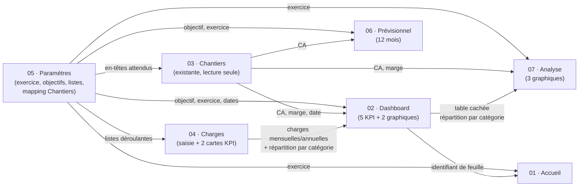

# Architecture technique — ERP Matière & Nuance

Document de référence pour quiconque modifie ce projet : plages nommées,
dépendances entre feuilles, flux de données, ordre d'installation.
Le README.md reste le point d'entrée (déploiement, choix produit) ; ce
document est la carte interne du moteur.

## 1. Principe général

Le classeur ne contient aucune base de données externe : les cellules
*sont* la base de données. Le script Apps Script ne fait que (re)poser
la structure — en-têtes, formules, validations, protections, graphiques
— autour de deux catégories de données qui, elles, ne sont jamais
générées par le script et doivent survivre à toute réinstallation :

- les **cellules de saisie** (Paramètres!B4:B9, Paramètres!B12:B15,
  Charges!A8:H1000) ;
- la feuille **Chantiers**, entièrement possédée par le client.

Toute formule du classeur qui a besoin d'une donnée passe par une
**plage nommée**, jamais par une référence de cellule brute (`Feuille!A1`)
ni par une valeur écrite en dur. C'est le seul mécanisme de couplage
entre feuilles — voir §3.

## 2. Table complète des plages nommées

| Plage nommée | Feuille physique | Cellule / plage | Créée par | Nature |
|---|---|---|---|---|
| `PARAM_EXERCICE` | Paramètres | B4 | `buildParametres_()` | Saisie |
| `PARAM_DATE_DEBUT` | Paramètres | B5 | `buildParametres_()` | Saisie |
| `PARAM_DATE_FIN` | Paramètres | B6 | `buildParametres_()` | Saisie |
| `PARAM_OBJECTIF_CA` | Paramètres | B7 | `buildParametres_()` | Saisie |
| `PARAM_OBJECTIF_MARGE` | Paramètres | B8 | `buildParametres_()` | Saisie |
| `PARAM_SALAIRE_MENSUEL` | Paramètres | B9 | `buildParametres_()` | Saisie |
| `PARAM_CHANTIERS_HEADER_CA_HT` | Paramètres | B12 | `buildParametres_()` | Saisie (mapping) |
| `PARAM_CHANTIERS_HEADER_MARGE_HT` | Paramètres | B13 | `buildParametres_()` | Saisie (mapping) |
| `PARAM_CHANTIERS_HEADER_DATE` | Paramètres | B14 | `buildParametres_()` | Saisie (mapping) |
| `PARAM_CHANTIERS_HEADER_STATUT` | Paramètres | B15 | `buildParametres_()` | Saisie (mapping) |
| `LISTE_CATEGORIES` | Paramètres | H3:H12 (masquée) | `buildParametres_()` | Liste technique |
| `LISTE_TVA` | Paramètres | I3:I6 (masquée) | `buildParametres_()` | Liste technique |
| `LISTE_PERIODICITE` | Paramètres | J3:J6 (masquée) | `buildParametres_()` | Liste technique |
| `LISTE_OUI_NON` | Paramètres | K3:K4 (masquée) | `buildParametres_()` | Liste technique |
| `CHARGES_CATEGORIE` | Charges | A8:A1000 | `buildCharges_()` | Saisie (colonne) |
| `CHARGES_MONTANT_HT` | Charges | E8:E1000 | `buildCharges_()` | Saisie (colonne) |
| `CHARGES_PERIODICITE` | Charges | D8:D1000 | `buildCharges_()` | Saisie (colonne) |
| `CHARGES_ACTIF` | Charges | H8:H1000 | `buildCharges_()` | Saisie (colonne) |
| `CHARGES_MENSUELLES` | Charges | B4 (carte KPI) | `buildCharges_()` | Calculée |
| `CHARGES_ANNUELLES` | Charges | E4 (carte KPI) | `buildCharges_()` | Calculée |
| `CHANTIERS_CA_HT` | Chantiers (existante) | colonne trouvée par en-tête, 5000 lignes | `ensureChantiersLinks_()` | Lecture seule |
| `CHANTIERS_MARGE_HT` | Chantiers (existante) | colonne trouvée par en-tête, 5000 lignes | `ensureChantiersLinks_()` | Lecture seule |
| `CHANTIERS_DATE` | Chantiers (existante) | colonne trouvée par en-tête, 5000 lignes | `ensureChantiersLinks_()` | Lecture seule |
| `CHANTIERS_STATUT` | Chantiers (existante) | colonne trouvée par en-tête, 5000 lignes | `ensureChantiersLinks_()` | Lecture seule (reliée, non filtrée — voir README) |
| `DASHBOARD_CA_REALISE` | Dashboard | B4 (carte KPI) | `buildDashboard_()` | Calculée |

Toutes les créations/mises à jour de plages nommées passent par
`setNamedRange_()` (`01_Utils.gs`), qui supprime l'ancienne définition
avant d'en recréer une — une réinstallation ne laisse donc jamais de
plage obsolète pointant vers du vide.

## 3. Graphe de dépendances entre feuilles



Point notable, volontaire : **Analyse dépend de Dashboard**, pas
seulement de Chantiers/Charges. Le graphique « Charges par catégorie »
d'Analyse réutilise directement la table cachée calculée par
`buildDashboardDonneesCategories_()` plutôt que de refaire le même
calcul une deuxième fois. Conséquence directe : **Dashboard doit
toujours être (re)construit avant Analyse** — c'est pour cette raison,
et pas seulement pour suivre l'ordre du cahier des charges, que
`installerERP()` respecte l'ordre ci-dessous.

## 4. Ordre d'installation (`99_Installation.gs`)

```
1. buildParametres_()        → doit être en premier : tout le reste lit ses plages nommées
2. buildCharges_()           → a besoin des listes de Paramètres (dropdowns)
3. ensureChantiersLinks_()   → a besoin du mapping saisi dans Paramètres (§2)
4. buildDashboard_()         → a besoin de Paramètres + Charges + Chantiers
5. buildPrevisionnel_()      → a besoin de Paramètres + Chantiers
6. buildAnalyse_()           → a besoin de Chantiers + PARAMÈTRES + DASHBOARD (table cachée réutilisée)
7. buildAccueil_()           → a besoin de Dashboard (identifiant de feuille pour le bouton)
```

Inverser 4 et 6, ou construire Analyse seule sans passer par
`installerERP()`, casse le 3ᵉ graphique d'Analyse (plage `Dashboard!T:U`
introuvable ou périmée). `buildAnalyse_()` appelle `getRequiredSheet_()`
sur Dashboard précisément pour échouer bruyamment dans ce cas plutôt que
produire un graphique vide silencieusement.

## 5. Modèle de protection

Deux régimes coexistent, jamais mélangés sur une même cellule :

- **Cellule de saisie** (`styleInputCell_()`) : fond légèrement teinté,
  bordure couleur accent, jamais protégée, jamais écrasée par une
  réinstallation si elle contient déjà une valeur.
- **Cellule calculée** (`protectAsCalculated_()`) : protection
  « avertissement » (`setWarningOnly(true)`) — l'édition reste possible
  mais un message prévient qu'il s'agit d'une formule. Choisi plutôt
  qu'un verrouillage dur pour éviter d'avoir à gérer une liste
  d'éditeurs autorisés, pour un classeur à utilisateur unique.

Chaque `build*_()` de feuille 100 % calculée (Dashboard, Prévisionnel,
Analyse, Accueil) commence par `resetSheet_()`, qui supprime d'abord
toutes les anciennes protections (`removeAllProtections_()`) avant
d'en reposer de nouvelles — une réinstallation ne accumule donc jamais
de protections fantômes.

## 6. Colonnes/lignes cachées, par feuille

| Feuille | Zone cachée | Contenu |
|---|---|---|
| Paramètres | Colonnes H:K | Listes techniques (Catégories, TVA, Périodicité, Oui/Non) |
| Dashboard | Colonnes Q:V | Table mensuelle CA (Q:R) + répartition par catégorie (T:U) — sources des 2 graphiques |
| Analyse | Colonnes J:L | Table mensuelle CA (K) / Marge (L) — sources des 2 premiers graphiques |

Rien n'est jamais masqué dans Charges ou Chantiers : ce sont des
tableaux de saisie/lecture, aucune donnée technique n'y est ajoutée.

## 7. Étendre le classeur

- **Ajouter un champ lu depuis Chantiers** (ex. un jour, un champ
  "Client") : ajouter une entrée à `CHANTIERS_FIELDS`
  (`00_Constantes.gs`) avec sa `row` (cellule Paramètres suivante,
  B16, B17…), son `defaultHeader` et un nouveau nom dans
  `NAMED_RANGES` — `buildParametresChantiersMapping_()` et
  `ensureChantiersLinks_()` s'adaptent automatiquement, aucune autre
  feuille à toucher.
- **Ajouter une feuille** : cahier des charges = exactement 7 feuilles,
  ne pas en ajouter une 8ᵉ sans validation explicite du client (voir
  CLAUDE.md du dépôt).
- **Changer une couleur/police/taille de graphique** : tout est
  centralisé dans `COLORS` / `FONT` (`00_Constantes.gs`) et
  `computeChartSize_()` (`01_Utils.gs`) — jamais de valeur répétée dans
  les modules de feuilles.
